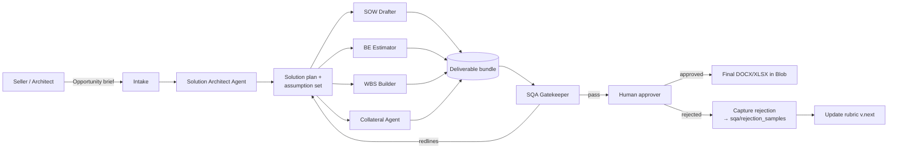

# Architecture — msft-sow-ai

## Goals

1. Generate first-pass-quality **SOW**, **BE**, **WBS**, **Collateral** for an MS Services
   opportunity in minutes, not days.
2. Ensure generated documents **pass SQA review on the first or second submission**.
3. Capture every SQA rejection as training data so the system improves monotonically.
4. Keep a human-in-the-loop approver — never auto-submit.

## High-level flow

## Agent roster

| Agent | Responsibility | Inputs | Outputs |
|---|---|---|---|
| **Intake** | Normalize opportunity brief, identify deal archetype | Free-form notes, CRM export | `OpportunityBrief` JSON |
| **Solution Architect** | Draft technical approach, assumptions, risks; pick reference deals | `OpportunityBrief`, won-deal corpus | `SolutionPlan` JSON |
| **SOW Drafter** | Produce SOW DOCX matching template profile | `SolutionPlan`, SOW template, clause library | SOW DOCX + `SOWManifest` |
| **BE Estimator** | Produce Budgetary Estimate XLSX | `SolutionPlan`, rate cards | BE XLSX + `BEManifest` |
| **WBS Builder** | Produce WBS with phases, tasks, RACI | `SolutionPlan` | WBS XLSX/MPP + `WBSManifest` |
| **Collateral Agent** | Customer-facing one-pager / slides | `SolutionPlan` | PPTX/PDF |
| **SQA Gatekeeper** | Run rubric; emit pass or redlines | All artifacts + `sqa/rubrics/*` | `SQAReport` (pass/fail + line-level findings) |

All agents are **Foundry Hosted Agents**. Orchestration uses the Foundry agent workflow
runtime (no custom Durable Functions this time — DOI proved we don't need that level of
control for this workload).

## Storage layout (Blob)

| Container | Purpose | Path pattern |
|---|---|---|
| `opportunities` | Raw inbound briefs | `opportunities/{oppId}/intake/...` |
| `corpus` | Grounding corpus (won deals, clauses, rate cards) | `corpus/{type}/{file}` |
| `runs` | Per-run agent traces and intermediate JSON | `runs/{oppId}/{runId}/{agent}.json` |
| `deliverables` | Final and draft DOCX/XLSX/PPTX | `deliverables/{oppId}/{version}/...` |
| `sqa-history` | Every gatekeeper report + human override | `sqa-history/{oppId}/{runId}.json` |

## State (Cosmos DB)

- `opportunities` — opportunity record + current status
- `runs` — one doc per generation run, with agent step results
- `sqa_findings` — every finding the gatekeeper has ever emitted (training data)
- `rubric_versions` — versioned rubric snapshots so old runs are reproducible

## Retrieval (AI Search)

One index per corpus type so the SOW Drafter and SQA Gatekeeper can scope queries:

- `idx-won-deals` — chunked past won SOWs (vector + keyword)
- `idx-clauses` — approved clause library
- `idx-rate-cards` — role + rate lookup
- `idx-rejection-samples` — historical SQA rejections, used by gatekeeper for analogy lookup

## SQA Gatekeeper — the secret sauce

The gatekeeper is **not just an LLM critic**. It runs three layers in order:

1. **Deterministic structural checks** (Python, fast, cheap)
   - Required sections present and in canonical order
   - Every assumption has an owner
   - Every cost line ties back to a WBS task
   - No "TBD" / "TODO" / "[insert]" tokens
   - Rate card values match the corpus
2. **Rubric-encoded checks** (`sqa/rubrics/v1.yaml`, mix of regex + small-LLM judges)
   - Each rule was extracted from a real SQA rejection
   - Each rule has: `id`, `severity`, `description`, `detector`, `remediation_hint`
3. **Analogy critic** (LLM with retrieval)
   - Retrieves the 5 most-similar historical rejections from `idx-rejection-samples`
   - Asks: "would this rejector reject this draft for the same reasons?"
   - Cheap, but high recall on novel issues

A finding from any layer becomes a structured redline returned to the relevant drafter.
The drafter must address every `severity: blocker` finding before re-submission.

## Versioning & reproducibility

- Every run pins a `rubric_version` and a `corpus_snapshot_id`.
- Re-running an old opportunity reproduces the same draft (same prompts, same retrievals).
- This matters for audit and for measuring whether rubric updates *actually* improve pass rate.

## Out of scope (explicitly)

- CRM integration (manual paste-in for now)
- e-Signature
- Pricing approval workflow (the BE is *budgetary*, not a quote)
- Customer-facing portal
